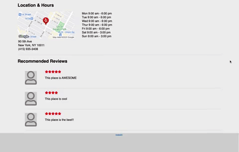

# Welcome to Gelp!

Gelp is a website that lets you find businesses and upload photos and reviews for that business.

# Techonologies Used:
### Back-end
- Ruby on Rails
### Front-end
- React.js and Redux
### Database
- PostgresSql
### For images
- Amazon Web Service
### For web page design and styling
- HTML and CSS

# Key Features

## User Authentication

Users can create a login or use a demo login provided to them via the demo login button.
While logged in, the navagation bar at the top of the screen will replace the login/signup links with a dropdown that includes a log out link.

## Image Upload

Users can upload an image to any business by clicking on the "Add Photo" button, which will redirect them to a photo upload page where they can add a photo and submit it:

This is done by creating a FormData object, which we add our photos to, and sending it to our backend via an AJAX request:

## Create Reviews

Users can create a review of any business by clicking on the "Write a Review" button, which will redirect them to a review form they can fill out to submit.

This is done by utilizing onChange handlers that will update our state when a user updates the form and a onSubmit handler that utilizes thunk actions which will send an AJAX request to update our data on the backend.

